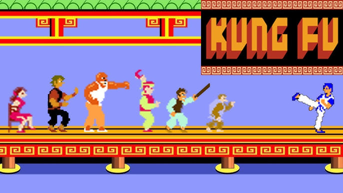

# Kung Fu Master AI Agent



**Teaching AI to master retro games through deep reinforcement learning** - A production-grade RL system featuring custom neural architectures, distributed GPU training, and advanced reward engineering.

## Core Achievements

🧠 **Custom Multi-Modal Neural Architecture** - Designed and implemented a hybrid CNN + MLP network that processes both visual frames (84x84x4) and structured game state (enemy positions, HP, projectiles) for superior decision-making

⚡ **High-Performance Distributed Training** - Built CUDA-optimized training pipeline with multi-process parallelization (4+ environments), achieving efficient learning through vectorized experience collection

🎯 **Advanced Reward Engineering** - Solved the sparse reward problem by designing dense reward signals across multiple objectives: combat effectiveness, survival optimization, and tactical positioning

🛠️ **Production-Ready ML System** - Implemented robust training infrastructure with emergency saves, checkpoint recovery, experience replay, and comprehensive metrics tracking

## Tech Stack

**ML/AI**: PyTorch • Stable-Baselines3 PPO • Custom CNN Architecture • CUDA
**Environment**: OpenAI Gym-Retro • NumPy • Multi-process vectorization

## Technical Deep Dive

### Multi-Modal State Processing
- **Visual Pipeline**: Custom CNN with adaptive pooling processes 84x84x4 stacked frames
- **State Vector**: 144-dimensional feature space tracking 5 enemies + projectiles + player stats
- **Fusion Architecture**: Multi-input actor-critic policy combines visual and symbolic reasoning

### Training Infrastructure
- **Parallelized Learning**: SubprocVecEnv with 4+ simultaneous game instances
- **GPU Acceleration**: CUDA-optimized neural network training with efficient memory management
- **Smart Checkpointing**: Auto-save best models based on composite scoring (combat + survival + diversity)
- **Imitation Learning**: Bootstrap training from human demonstrations via NPZ recording system

### Intelligent Reward Shaping
Engineered multi-objective reward function balancing:
- Combat metrics (enemy hits, damage dealt)
- Survival incentives (HP preservation, dodge rewards)
- Tactical positioning (enemy distance, action diversity)
- Normalized rewards for stable gradient descent

## Quick Start

```bash
# Train agent (GPU)
python train.py --num_envs 4 --cuda --timesteps 10000

# Resume training
python train.py --cuda --timesteps 10000 --resume

# Watch trained agent
python train.py --render --resume

# Record human gameplay
python capture.py --state_file gameplay.state
```

## Implementation Highlights

**Custom Environment Design** - Built wrapper with observation preprocessing, multi-enemy tracking system, and frame stacking for temporal awareness

**Neural Architecture Innovation** - Designed hybrid network architecture processing both pixel data and structured state vectors (144-dim feature space)

**Distributed GPU Training** - Multi-process vectorized environments with CUDA optimization for 4x+ training speedup

**Robust ML Pipeline** - Production-grade error handling, emergency saves, SIGINT handlers, and comprehensive logging

## What This Demonstrates

**Deep RL Expertise** → Implemented PPO from Stable-Baselines3 with custom multi-input policy and reward engineering

**System Design** → Architected complete ML pipeline: data collection, training, evaluation, deployment

**Performance Engineering** → CUDA optimization, multi-process parallelization, efficient memory management

**Problem Solving** → Solved sparse rewards, designed multi-objective reward functions, balanced exploration vs exploitation

**Production Skills** → Error handling, checkpointing, logging, graceful degradation, user-facing tools

---

**Built end-to-end**: Environment design → Reward engineering → Neural architecture → Distributed training → Model deployment

💼 This project showcases skills directly applicable to ML engineering roles in robotics, autonomous systems, game AI, and production ML infrastructure.
